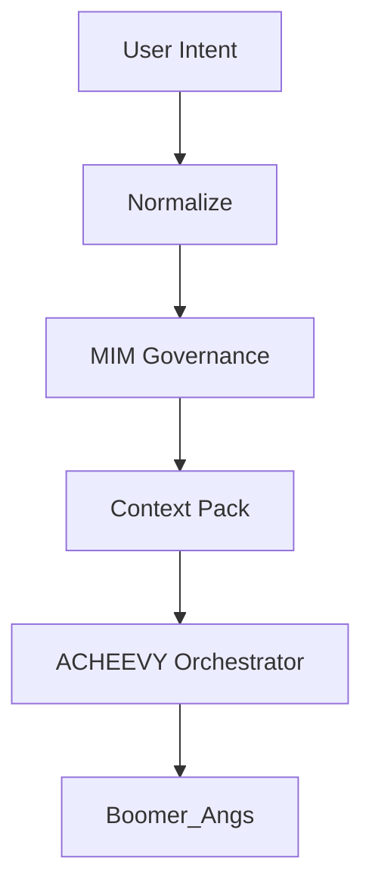

# MIM (Context Governance)

> [!IMPORTANT]
> **MIM is not an agent.** It is the governing logic and context management layer of the GRAMMAR runtime.

MIM stands for **Managed Information Marketplace** (or similar context-driven governance). It serves as the single source of truth for the **Context Pack** that all agents must operate within.

## Responsibilities

1. **Governance**: Enforces rules, policies, and laws across all runtime operations.
2. **Context Pack Management**: Bundles intent, memory, constraints, and approvals into a governed package.
3. **Revisions & Approvals**: Tracks Every change order and gates execution until approvals are met.
4. **Distribution**: Routes the governed context to the appropriate agents (coordinated by ACHEEVY).
5. **Memory Management**: Bridges transient session state to long-term multimodal vector storage.

## The MIM Context Pack

Before any execution occurs, MIM assembles a Context Pack containing:
- **Objective**: The normalized intent (via NTNTN).
- **Constraints**: Security, budget, and capability boundaries.
- **Inputs**: Multimodal samples (vision, voice, text).
- **Approvals**: The ledger of required user Y/N gates.
- **History**: Relevant semantic fragments from the Brain.

## Distribution Flow

## Laws of MIM
- MIM never "guesses"; it only validates.
- MIM does not perform tasks; it permits them.
- MIM ensures every outcome is traceable and carries the required evidence.
