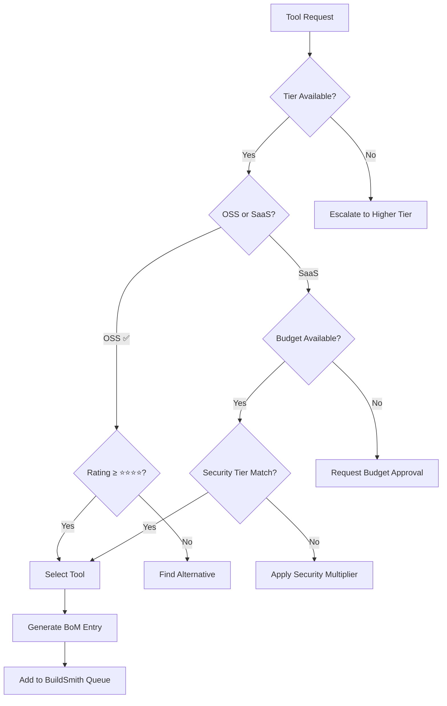

# Deploy by: ACHIEVEMOR — Unified Command Center

**Engine:** ACHEEVY (Digital CEO) | **Governance:** SIVIS Framework | **Mission:** Think It. Prompt It. Let ACHEEVY Manage It.

 

> **At ACHIEVEMOR, urgency is at our core. We are small enough to care, but big enough to compete.**

---

## 🎯 **QUICK NAVIGATION**

### **For Humans:**
- [🚀 Get Started](#get-started) - Launch your first plug
- [🏭 Tool Warehouse](#tool-warehouse) - Browse 129+ tools across 11 shelves  
- [⚙️ SIVIS Framework](#sivis-framework) - Governance & orchestration
- [💰 Pricing & Tiers](#pricing-tiers) - Transparent pricing model
- [📊 API Reference](#api-reference) - For developers & integrations

### **For AI Agents:**
- [🤖 Agent Commands](#agent-commands) - Structured commands for AI consumption
- [📋 Tool Selection Matrix](#tool-selection-matrix) - Decision tree for Picker_Ang
- [🔒 Governance Protocols](#governance-protocols) - HITL gates and approval chains
- [📈 KPI Tracking](#kpi-tracking) - Success metrics and monitoring

---

## 🚀 **GET STARTED**

### **Operating Modes**
1. **"Let ACHEEVY manage it" (Fast)** - Fully autonomous with HITL only at risk gates
2. **"Let ACHEEVY guide me" (Interactive)** - Step-by-step approval process

### **The 10-Step BAMARAM Process**
```
RFP Intake → Response → Proposal → Quote → SoW/Tech → PO → Assignment → QA/Sec → Delivery → Completion
     ↓         ↓         ↓        ↓       ↓       ↓         ↓         ↓        ↓          ↓
   Charter   Charter   Charter  Charter Charter Charter   Charter   Charter  Charter    Charter
    Row       Row       Row      Row     Row     Row       Row       Row      Row        Row
```

### **Key Guarantees**
- ✅ **Deterministic orchestration** with HITL gates
- ✅ **ICAR/ACP audit trails** for full transparency  
- ✅ **Security tier controls** (Light → Defense-Grade)
- ✅ **Public-safe pricing** (no internal margins exposed)
- ✅ **BAMARAM delivery signal** for completion

---

## ⚙️ **SIVIS FRAMEWORK**

 

### **Core Components**

#### **SIVIS (Strategic Intelligence & Oversight)**
- **Role:** External oversight/holding layer for ACHIEVEMOR ecosystem
- **Function:** Governance advisor, expert resource dispatch, ledger review
- **Interaction:** Escalation-only during runtime

#### **TINIT (Innovation Module)** 
- **Purpose:** Ideation and creative problem-solving
- **Components:** Research, analysis, Blue Ocean differentiation
- **Output:** Strategic recommendations and innovation pathways

#### **ROTATOR (Execution Module)**
- **Purpose:** Implementation and delivery orchestration  
- **Components:** Build pipelines, QA/security, deployment
- **Output:** Production-ready plugs and services

#### **Agent Foundry**
- **Network:** Distributed agent collaboration system
- **Protocol:** Binary communication channels (0110, 0010, etc.)
- **Coordination:** Multi-agent task distribution and synthesis

### **FDH Loop Integration**
- **Foster:** Generate options and possibilities
- **Develop:** Convert ideas into actionable steps  
- **Hone:** Refine and optimize for production delivery

---

## 🏭 **TOOL WAREHOUSE**

### **Warehouse Statistics**
- **Total Tools:** 129 across 11 functional shelves
- **Rating Distribution:** 35 Elite (⭐⭐⭐⭐⭐) | 65 Professional (⭐⭐⭐⭐) | 28 Standard (⭐⭐⭐)
- **Availability:** 36 All Tiers | 59 Entry+ | 26 Mid+ | 7 Superior Only

### **Shelf Organization**

| Shelf | Category | Tools | Focus Area |
|-------|----------|-------|------------|
| 🏪 **Shelf 1** | Orchestration & AI Core | 20 | Agent frameworks, LLMs, orchestration |
| 🏈 **Shelf 2** | Sports Analytics & Data | 15 | Recruiting data, proprietary algorithms |
| 📋 **Shelf 3** | Planning & Task Management | 12 | CLI tools, workflows, documentation |
| 💻 **Shelf 4** | Sandbox & Build Environment | 11 | Containers, CI/CD, serverless ops |
| 🔍 **Shelf 5** | Research & Data Enrichment | 12 | Search, scraping, structured QA |
| 🎤 **Shelf 6** | UI/Voice & User Experience | 11 | Speech, avatars, rapid UI frameworks |
| 🖼️ **Shelf 7** | Frontend Rendering | 13 | React, styling, presentation tools |
| 💾 **Shelf 8** | Data & Memory Management | 11 | Databases, vectors, memory systems |
| 🔒 **Shelf 9** | Security & Audit Systems | 9 | Scanners, monitoring, compliance |
| 📧 **Shelf 10** | Delivery & Billing | 6 | Email, payments, communications |
| 🤖 **Shelf 11** | Autonomous Systems | 9 | Agent automation, 3D/VR systems |

---

## 💰 **PRICING & TIERS**

| Tier | Monthly Fee | Token Pool | Overage Rate | Best For |
|------|-------------|------------|--------------|----------|
| **Freemium** | $7.00 | 25,000 | $0.06/1K | Hobbyist exploration |
| **Entry** | $19.99 | 200,000 | $0.06/1K | Startup prototypes |
| **Mid** | $79.99 | 600,000 | $0.06/1K | Agency management |
| **Unlimited** | $149.99 | 1,500,000 | $0.06/1K | Enterprise automation |
| **Superior** | $299.99 + $150 setup | 1,500,000 | $0.04/1K | R&D teams with custom features |

### **Security Tier Multipliers**
- **Light:** 1.0x (SBOM + dependency scan)
- **Medium:** +25% (adds SAST)  
- **Heavy:** +50% (adds DAST + containerization)
- **Superior:** +100% (adds runtime attestation)
- **Defense-Grade:** +200% (military-grade encryption)

---

## 🤖 **AGENT COMMANDS**

### **For Picker_Ang (Tool Selection)**
```yaml
command: select_tools
parameters:
  - shelf_id: [1-11]
  - tier_requirement: [All Tiers|Entry+|Mid+|Superior]
  - classification_filter: [Agent Framework|LLM Model|Security Scanner|etc.]
  - rating_minimum: [⭐⭐⭐|⭐⭐⭐⭐|⭐⭐⭐⭐⭐]
output_format: BoM_JSON + Security_Addendum
```

### **For BuildSmith (Installation & Integration)**
```yaml
command: build_plug
parameters:
  - bom_json: {tools: [], versions: {}, licenses: [], security_addons: []}
  - security_tier: [Light|Medium|Heavy|Superior|Defense-Grade]
  - test_requirements: [SBOM|SAST|DAST|OPA/Rego|Performance]
output_format: QA_Evidence_Bundle + Farmer_Certificate
```

### **For ACHEEVY (Orchestration)**
```yaml
command: orchestrate_engagement  
parameters:
  - mode: [manage_it|guide_me]
  - confidence_threshold: 0.85
  - hitl_gates: [Proposal|Quote|SoW|QASec|Growth]
  - charter_alignment: required
output_format: BAMARAM_Signal + Completion_Summary
```

---

## 📋 **TOOL SELECTION MATRIX**

### **Decision Tree for AI Agents**



### **Classification Priority Matrix**

| Priority | Classification | Shelf Location | Selection Criteria |
|----------|----------------|----------------|--------------------|
| **P0** | Internal System | Shelf 1 | Always include if available |
| **P1** | Agent Framework | Shelves 1, 11 | Match complexity requirements |
| **P1** | LLM Model | Shelf 1 | Match cost/performance needs |
| **P2** | Security Scanner | Shelf 9 | Match security tier requirements |
| **P2** | Vector Store | Shelf 8 | Match data volume requirements |
| **P3** | UI Framework | Shelves 6, 7 | Match interface requirements |
| **P4** | Development Container | Shelf 4 | Environment standardization |

---

## 🔒 **GOVERNANCE PROTOCOLS**

### **HITL Gate Requirements**

| Gate | Approver | Required Confidence | Artifacts | Criteria |
|------|----------|--------------------|-----------|-----------| 
| **Proposal** | NTNTN | ≥ 0.85 | Commercial + Technical Proposal | 4Q+SWOT complete, Blue Ocean differentiation |
| **Quote** | NTNTN | ≥ 0.85 | Public-safe pricing surfaces | Plan/pool/buffer/overage only |
| **SoW/Tech** | NTNTN + Farmer | ≥ 0.85 | Technical specification | DMAIC/DMADV track selected |
| **QA/Sec** | Farmer + NTNTN | ≥ 0.85 | Evidence bundle + certificate | All security scans passed |
| **Growth** | Union | ≥ 0.85 | Completion summary | Legal & data rights documented |

### **ICAR Logging Requirements**
```yaml
ICAR_Entry:
  Intent: "What was the goal/purpose"
  Context: "Situational factors, confidence score, constraints"  
  Action: "Specific action taken, by whom/what"
  Result: "Outcome, artifacts produced, next steps"
  Metadata:
    timestamp: ISO-8601
    confidence: float_0_to_1
    owner: agent_or_human_id
    charter_row: corresponding_charter_reference
```

### **Charter Alignment Rules**
1. **Every major action** must have corresponding Charter row
2. **Customer-safe surfaces only** in Charter (no internal margins/costs)
3. **Pointer-level references** to artifacts (URI, timestamp, owner)
4. **HITL results** recorded as checkmarks or approval signatures
5. **Evolution tracking** via Story Baton deltas

---

## 📈 **KPI TRACKING**

### **System Performance Metrics**
- **HITL Approval Rate:** Target ≥ 95% on-time
- **QA/Security Evidence Completeness:** Target 100%
- **ICAR/ACP Coverage:** Target 100% of material actions
- **RFP → Quote Time:** Target ≤ 2 hours with cached contexts
- **Delivery Activation:** Target ≤ 60 seconds
- **Policy Violations:** Target ≤ 0.1%

### **Business Performance Metrics**
- **Customer Satisfaction:** Target ≥ 4.5/5.0
- **Plug Success Rate:** Target ≥ 90% meet stated KPIs
- **Revenue per User (ARPU):** Track by tier
- **Token Utilization:** Track vs. allocated pools
- **Churn Rate:** Target ≤ 5% monthly

### **Technical Performance Metrics**
- **Build Success Rate:** Target ≥ 95%
- **Security Scan Pass Rate:** Target 100%
- **Integration Test Success:** Target ≥ 98%
- **Performance Benchmarks:** Meet or exceed SLA
- **Uptime/Availability:** Target ≥ 99.9%

---

## 📚 **VOCABULARY & DEFINITIONS**

### **Core Terms**
- **ACHEEVY:** AI Engine consultant with Elite PM + Six Sigma Black Belt capabilities
- **ACHIEVEMOR:** Parent company name for the entire ecosystem  
- **Boomer_Ang:** Specialized AI agents (Developer, Designer, QA, Security, DevOps, Data)
- **Picker_Ang:** Intelligent tool selection system from the warehouse
- **Plug:** Custom application or solution built by the factory
- **BAMARAM:** Final delivery signal when plug is deployed to user dashboard
- **Charter:** Customer-safe contract/receipt of the engagement
- **Ledger:** Internal mirror with full audit trail and metadata

### **Process Terms**
- **DMAIC:** Define, Measure, Analyze, Improve, Control (Six Sigma methodology)
- **DMADV:** Define, Measure, Analyze, Design, Verify (for new solutions)
- **FDH:** Foster, Develop, Hone (self-evolution loop)
- **HITL:** Human-in-the-Loop process ensuring quality and oversight
- **ICAR:** Intent, Context, Action, Result (audit logging format)
- **KNR:** Knowledge, Network, Reputation (embedded in all stages)
- **POB:** Proof of Benefit (value creation vs. energy waste)

### **Technical Terms**
- **BoM:** Bill of Materials (complete dependency tree)
- **SBOM:** Software Bill of Materials (security artifact)
- **OPA/Rego:** Policy engine for governance rules
- **RAG:** Retrieval-Augmented Generation for enhanced AI responses
- **Vector DB:** Database for storing and retrieving AI embeddings
- **SAST/DAST:** Static/Dynamic Application Security Testing

---

## 🌟 **PROOF OF BENEFIT (POB)**

### **Traditional PoW vs. Deploy POB**

| Traditional PoW Systems | Deploy POB Systems |
|------------------------|-------------------|
| ❌ Energy waste on meaningless computation | ✅ Value creation through meaningful contribution |
| ❌ Value extraction from environment | ✅ Permanent receipt of benefit delivered |
| ❌ Competitive zero-sum dynamics | ✅ Collaborative positive-sum outcomes |
| ❌ Environmental degradation | ✅ Sustainable intelligence growth |
| ❌ Centralized control structures | ✅ Distributed governance models |

### **Quantified Benefits**
- **Task Automation:** 60-80% workload reduction
- **Research Acceleration:** 10x faster insights  
- **Decision Quality:** 40% improvement in accuracy
- **Cost Optimization:** 30% reduction in tool licensing
- **ROI Achievement:** 300-500% within 6 months

---

## 🔗 **API REFERENCE**

### **Base URL**
```
https://api.achievemor.com/v1/
```

### **Authentication**
```bash
curl -H "Authorization: Bearer YOUR_API_KEY" \
     -H "Content-Type: application/json"
```

### **Core Endpoints**

#### **Create Plug**
```bash
POST /plugs
{
  "name": "My Custom Plug",
  "description": "AI-powered analytics dashboard",
  "tier": "Mid",
  "security_level": "Medium",
  "requirements": ["data_visualization", "real_time_updates"]
}
```

#### **Get Tool Inventory**
```bash
GET /warehouse/tools?shelf={shelf_id}&tier={tier}&classification={type}
```

#### **Check Build Status**
```bash
GET /plugs/{plug_id}/status
```

#### **Retrieve KPIs**
```bash
GET /plugs/{plug_id}/metrics?timeframe={days}
```

---

## 📞 **SUPPORT & COMMUNITY**

### **Getting Help**
- 🎯 **Quick Start:** Follow the BAMARAM process guide
- 📖 **Documentation:** Complete API and tool references
- 💬 **Community:** Join our growing user community
- 🎫 **Support:** Enterprise support for Mid+ tiers

### **Contact**
- **General Inquiries:** hello@achievemor.com
- **Technical Support:** support@achievemor.com  
- **Partnership:** partners@achievemor.com

---

**Powered by ACHIEVEMOR | Orchestrated by ACHEEVY | Governed by SIVIS**

*"Think It. Prompt It. Let ACHEEVY Manage It."*